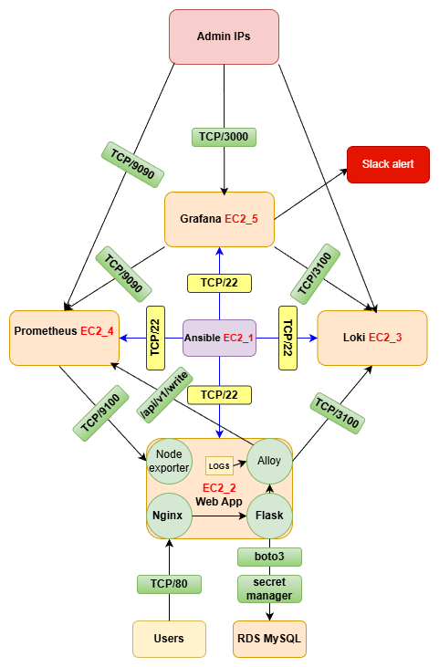
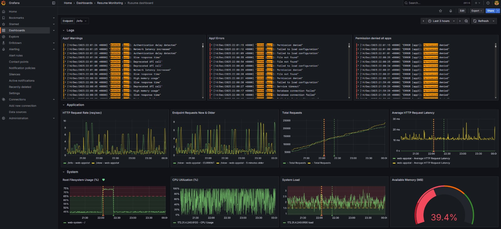

AWS MONITORING STACK – TERRAFORM + ANSIBLE + GRAFANA / PROMETHEUS / LOKI
=====================================================================

OVERVIEW
--------
This project provisions and deploys a complete AWS-based monitoring stack
using Terraform and Ansible.

Metrics are collected via Prometheus exporters and application endpoints,
then scraped or received by Prometheus.
Logs are collected by Grafana Alloy and stored in Loki.
Grafana is used as the single visualization layer.

##  Application & Monitoring Flow

The diagram below illustrates the full observability flow:
- Prometheus scrapes metrics from the application EC2
- Grafana Alloy pushes logs to Loki
- Grafana queries both Prometheus and Loki



HIGH-LEVEL ARCHITECTURE
----------------------
The infrastructure consists of 5 EC2 instances:

1. Ansible Control Node
   - Executes Ansible playbooks
   - Manages all other EC2 instances

2. Grafana EC2
   - Grafana UI (TCP 3000)
   - Queries Prometheus and Loki

3. Prometheus EC2
   - Prometheus server (TCP 9090)
   - Scrapes metrics from exporters and applications

4. Loki EC2
   - Loki log database (TCP 3100)
   - Receives logs from Alloy agents

5. Application EC2
   - Nginx (HTTP entrypoint)
   - Flask backend application
   - Node Exporter (metrics)
   - Alloy (logs)


NETWORK & ACCESS FLOW
---------------------
- Internet / Users
  -> TCP 80
  -> Application EC2 (Nginx + Flask)

- Admin IPs
  -> TCP 3000
  -> Grafana EC2

- Grafana EC2
  -> TCP 9090 (queries)
  -> Prometheus EC2

- Prometheus EC2
  -> TCP 9100 (scrape)
  -> Application EC2 (Node Exporter)

- Grafana Alloy (on Application EC2)
  -> TCP 3100 (push)
  -> Loki EC2


METRICS FLOW (PROMETHEUS)
------------------------
1. Node Exporter runs on the Application EC2
   - Exposes system metrics on TCP 9100
   - CPU, memory, disk, filesystem, load
   - Synthetic stress logs

2. Flask application exposes:
   - /metrics endpoint

3. Prometheus EC2:
   - Scrapes Node Exporter metrics
   - Scrapes Flask /metrics endpoint
   - Stores time-series metrics

4. Grafana:
   - Queries Prometheus
   - Displays dashboards and alerts


LOGGING FLOW (LOKI)
------------------
1. Applications generate logs on Application EC2:
   - Flask logs
   - Nginx access & error logs

2. Alloy runs on the same Application EC2:
   - Tails log files
   - Enriches logs with labels
   - Pushes logs to Loki

3. Loki EC2:
   - Stores logs
   - Provides log query API

4. Grafana:
   - Queries Loki
   - Visualizes and filters logs

5. Application EC2
   - Nginx (reverse proxy)
   - Flask backend application (/metrics exposed)
   - Node Exporter (system metrics)
   - Grafana Alloy (logs & optional metrics)

REPOSITORY STRUCTURE
--------------------

```text
aws-monitoring/
├── terraform/
│   ├── provider.tf          # AWS provider configuration
│   ├── instances.tf         # EC2 instances (Grafana, Prometheus, Loki, App, Ansible)
│   ├── security.tf          # Security Groups & networking rules
│   ├── rds.tf               # RDS MySQL instance
│   ├── iam.tf               # IAM roles & policies (Secrets Manager access)
│   ├── variables.tf         # Input variables
│   ├── outputs.tf           # Terraform outputs
│   └── templates/
│       ├── deploy.tmpl      # Generates deployment script after terraform apply
│       └── inventory.tmpl   # Generates Ansible inventory
│
└── ansible/
    ├── playbook.yml         # Main Ansible playbook
    ├── inventory            # Generated by Terraform
    └── roles/
        ├── grafana/         # Grafana installation & configuration
        ├── prometheus/      # Prometheus server setup
        ├── loki/            # Loki server setup
        ├── node/            # Node Exporter (system metrics)
        ├── alloy/           # Grafana Alloy agent (log shipping)
        ├── flask/           # Flask app + Nginx configuration
        └── stress/          # Load & log generation for demo/testing

```

DEPLOYMENT FLOW
---------------
1. Terraform Apply
   - Provisions infrastructure
   - Generates Ansible inventory and deploy script

2. VS Code Task
   - Runs terraform apply
   - Executes generated deploy script

3. Ansible
   - Installs services
   - Configures exporters and agents
   - Starts systemd services


# AWS Monitoring Stack

## 📊 Grafana Dashboard (Metrics & Logs)

This dashboard shows:
- HTTP request rate and latency
- System CPU, memory, disk usage
- Application warnings and errors via Loki



---
